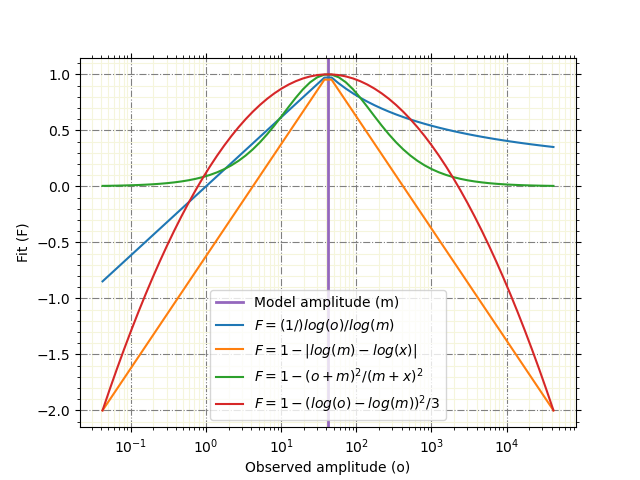

.. ----------------------------------------------------------------------------
.. Title:   Seismological Visualisation 
.. Author:  Fred Massin
.. License: ...
.. ----------------------------------------------------------------------------
.. _chap-map:

Basic plotting
==============

Basic plotting can be made more functional-looking. Here is an example:

   Basic plot
   :label:`figure-functions-plots` (sources: :source:`apps/funct.py`).
   
Breaking it up
--------------
First it is possible to get intermediary ticks as follows:   

.. code:: python

   >>> ax.yaxis.set_minor_locator(matplotlib.ticker.AutoMinorLocator())
   >>> ax.xaxis.set_minor_locator(matplotlib.ticker.AutoMinorLocator())
   

Another trick is to make sure all ticks are drawn on all axis of the plot:

.. code:: python

   >>> ax.tick_params(right=True, top=True,
                      left=True, bottom=True,
                      which='both')

Guide lines also help to visualise the dynamic of the represented data:

.. code:: python

   >>> ax.grid(visible=True, which='major', color='gray', linestyle='dashdot', zorder=-99)
   >>> ax.grid(visible=True, which='minor', color='beige',  ls='-', zorder=-99)

Wrapping it up 
--------------

An example wrapping this up is available in `apps/plot_funct.py` and can be used as follows:

.. code:: shell

   >>> apps/plot_funct.py
   Default reference model value is setup to 0.0001
   Use /Users/fred/Documents/Projects/NaiNo-Kami/seismo-viz/apps/plot_funct.py <model value> to set a different reference model value

